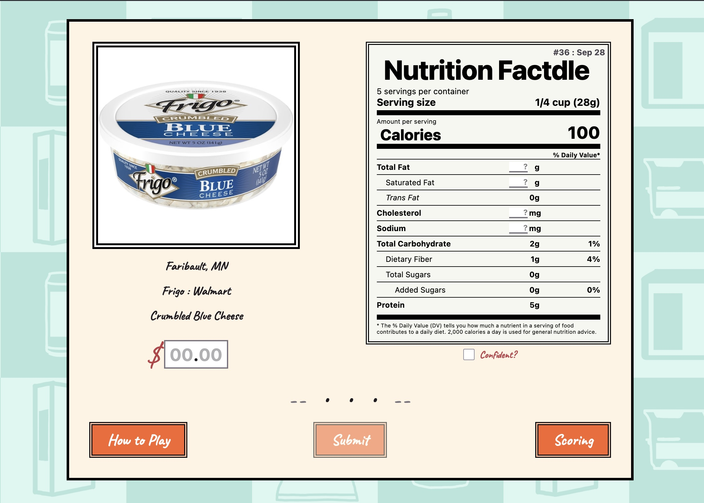
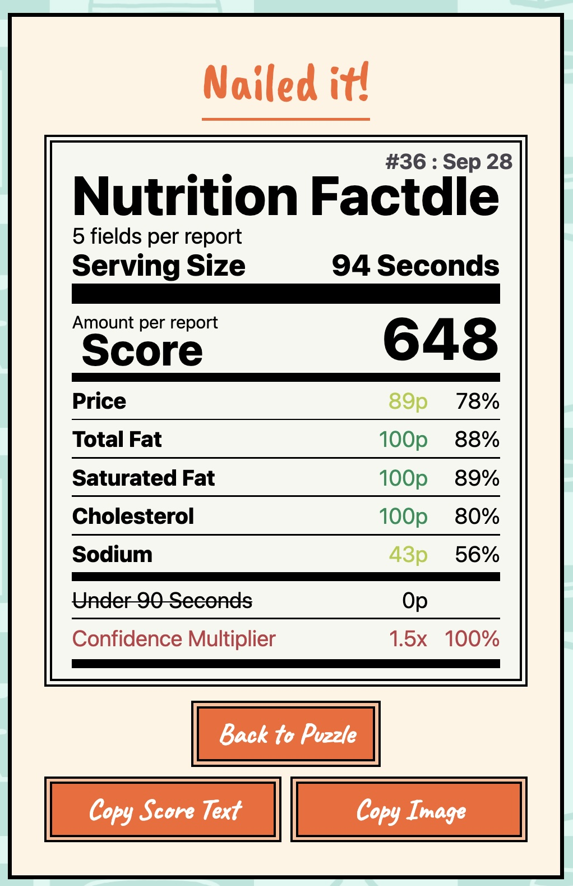

# nutritionfactdle.com: Daily Nutrition Guessing Game!

A daily browser game like Connections or Worldle: each day features a food item which players 
guess its price and several nutrition label values (calories, fat, sugar, etc.) with partial 
information. They're given a picture, the brand, the store, and a somewhat-filled label. 
After three guesses with feedback, the user is directed to a score page where they can share
their results via text or image. 

https://nutritionfactdle.com

Nutrition Factdle

#036 : Sep 28 • 648 points

✅ Confident 😎

🟨🟩🟩🟩🟨

nutritionfactdle.com





| | |
|---|---|
| **Timeframe** | ~3 weeks, 8 sessions |
| **Languages** | TypeScript, Svelte, Go |
| **Size** | ~6,000 lines across the game, tests, and internal tools |
| **Platform / hosting** | Cloudflare Workers (serverless), Cloudflare D1 (database), Cloudflare R2 (image storage), Cloudflare Analytics Engine |
| **Libraries / tooling** | SvelteKit, Drizzle ORM, Playwright (end-to-end testing), Vitest (unit testing), GitHub Actions (CI), Claude Code |
| **Relevant to** | Full-stack web development, product/game design, serverless architecture, production envrionments, UI design, mobile design, separate mobile/destop interfaces, IaC |

## The game

Players all share the same food item for any given day, and have three attempts to adjust their
guesses. After each attempt, players receive feedback via colored arrows next to each guess. 
There's an optional "confidence mode" toggle where if enabled, players only have 1 attempt, but 
get a 1.5x point multiplier. At the end of a round, players can choose to share either a scorecard 
styled as a nutrition label (that they can post without spoiling the answer) or a emoji-based text
summary similar to other daily games.

## Skills demonstrated

- Full-stack ownership: All parts of the project I created solo: game logic, database, API, visuals,
  deployment pipeline, etc.
- Serverless/edge architecture: utilizes Cloudflare's cloud environment instead of a traditional
  server - database (D1), file storage (R2), and analytics
- Automated testing and CI: unit tests for the scoring logic, browser-driven end-to-end
  tests, and a GitHub Actions pipeline that runs them on every change
- AI collaboration: used Claude Code to assist with planning, writing/reviewing code, 
  research, debugging, and best practices.

## Some Technical problems solved

- **Serving photos with no 'real' backend** Puzzle photos are stored with
  Cloudflare's file storage and served through a short redirect. Serving through typical
  means would be a lot more expensive and subject to more possible issues.
- **Collecting usage stats without tracking players** After each round, the game logs
  anonymous stats (country, guesses, time, etc.) to Cloudflare Analytics Engine. It's built 
  for high-volume writes with the downside of slow reads. Using a regular database for this 
  would quickly grow costly, while CAE is designed for use cases like this.
- **Font differences across platforms** The FDA recommends Helvetica for the Nutrition Facts
  label, but helvetica either requires a paid license to use, or is not available on all major
  platforms as in-browser text. To solve this, I use different fonts on each major system: Arial
  bold on Windows and Helvetica on Apple Systems. On Linux, there is too much variance of installed 
  fonts to pick one, so the fonts are laid out in priority order. A consequence of this is that
  certain text elements have to be sized differently based on the chosen font, and some text elements
  are also wrapped in additional dynamically-resizing containers to avoid overflow.
- **Appearing on search engines (mild SEO)** Search engines take a while to index new websites,
  and generally rank them low unless there are large amounts of traffic or external links to it. I
  signed up nutritionfactdle for Bing Webmaster and Google Search Console to first appear in searches,
  and then contacted several -dle lists requesting for it to be added. Nutritionfactle appears
  in searches and the AI summary, but only after users assure the search engine that they really
  did mean "NutritionFactdle" and not "Nutrition Facts le."

## Repository layout

```
src/routes/    Pages and API endpoints (SvelteKit)
src/lib/       Game logic, scoring, shared components
migrations/    Database schema history
e2e/           Browser-driven end-to-end tests
tools/         Local-only content-authoring tool for adding new daily puzzles
```

Repository private, but I can provide temporary access or show you code if requested.
